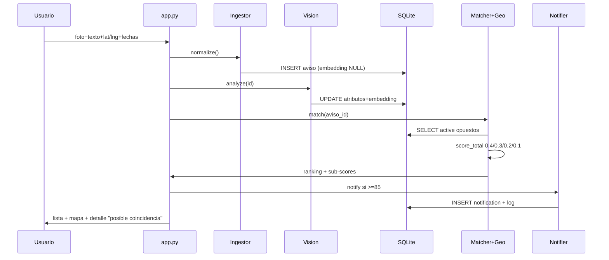

# MascotasLost&Found — architecture.md

> Fuente: `requirements.md` (§REQ-03 a §REQ-08, v1.0 23/09/2026).
> Stack **cerrado**: Streamlit + Python + SQLite, 100% local. CLIP 512-dim + MiniLM multilingüe. Radio 15 km. Umbrales `>=`.

## 1. Visión arquitectónica

Monolito Streamlit + módulos Python por agente + SQLite como única persistencia. Sin servicios externos obligatorios para que el profesor ejecute en local con un comando.

Elección justificada por restricciones: 2 semanas, evaluación local <10 min, corpus 15-20 avisos, sin scraping.

```
[ Usuario Streamlit ]
   | foto + texto + ubicación + fecha
   v
[1. Ingestor] --normaliza--> [SQLite: avisos]
   |
   v
[2. Vision Analyst] --atributos + image_embedding--> [SQLite update]
   |
   v (aviso activo)
[3. Matcher] <--consulta--> [SQLite active lost/found]
   |  ├─ pide similitud_visual (coseno embeddings)
   |  ├─ pide proximidad_geo a [4. Geo]
   |  ├─ calcula similitud_texto (estruct + semántica)
   |  └─ calcula proximidad_temporal (ventana 30d)
   v
[Ranking score_total + sub-scores]
   |
   ├─ >=85% --> [5. Notifier] --> panel Streamlit + log + tabla notifications
   ├─ 65-84.99% --> listado normal
   └─ <65% --> solo indexado
   |
   v
[Mapa + Detalle "posible coincidencia" + aviso no-identidad]
```

Texto del aviso legal obligatorio en UI/detalle/notificación: "La imagen no permite confirmar identidad. Verifica en persona."

## 2. Stack cerrado 23/09/2026 (100% local)

| Capa | Decisión | Notas |
|---|---|---|
| App / UI | Streamlit (`app.py`) + `streamlit-folium` (Leaflet clicable) | Español solo; Jerez de la Frontera como seed |
| Backend lógica | Python 3.11, módulos `agents/` puros | Sin LangChain/CrewAI |
| Base datos | SQLite (`data/huellas.db`) + sqlite3 | Cero setup |
| Vector store | Misma SQLite: `image_embedding` JSON 512-dim + `text_embedding` opcional | Coseno en numpy, sin FAISS/Chroma |
| Visión | CLIP `openai/clip-vit-base-patch32` 512-dim | `breed_guess` NULL si `other` |
| Texto | `sentence-transformers/paraphrase-multilingual-MiniLM-L12-v2` sobre `description_text` + 70% estructurado | Campos: `color_primary`, `markings`, `has_collar`, `size` |
| Geo | haversine local + `max(0, 1 - km/15)` | Radio fijo 15 km |
| Temporal | `max(0, 1 - dias/30)`, fecha = `date_last_seen` si existe si no `date_reported` | Ventana 30d |
| Notifier MVP | Panel/tabla Streamlit + `data/notifications.log` + tabla `notifications` | Sin Telegram |
| Seed | `data/seed/lost/*.json` + `found/*.json` + `images/*` + `scripts/load_seed.py` | 15-20 avisos Jerez |
| Estado | Botón "Marcar como resuelto" + `expire_old()` 30d bajo demanda | Sin cron |

## 3. Estructura de carpetas (propuesta)

```
huellas/
  app.py
  requirements.txt
  README.md / PROMPT-LOG.md / INFORME.md
  requirements.md / architecture.md (este repo: raíz, espejo en specs/ si se quiere)
  agents/
    ingestor.py      # REQ-06.1
    vision.py        # REQ-06.2
    matcher.py       # REQ-06.3 + REQ-07
    geo.py           # REQ-06.4
    notifier.py      # REQ-06.5 + REQ-08
  rag/
    embeddings.py    # texto semántico
    retrieval.py     # top-k + filtros active + tipo opuesto
  data/
    huellas.db
    seed/lost/*.json
    seed/found/*.json
    seed/images/*
    notifications.log
  scripts/
    load_seed.py
    eval_match.py    # test ÉXITO-01/03 con vectores fijos
  tests/
    test_matcher.py
    test_geo.py
```

## 4. Modelo de datos y relación con código

Tabla `avisos` espejo 1:1 del esquema REQ-05:

- `id TEXT PK, type TEXT CHECK(lost,found), animal TEXT, breed_guess TEXT NULL, color_primary TEXT, color_secondary TEXT NULL, markings JSON, size TEXT, has_collar INT, collar_description TEXT NULL, description_text TEXT, lat REAL, lng REAL, address_text TEXT NULL, date_reported TEXT, date_last_seen TEXT NULL, image_url TEXT, image_embedding JSON, contact_info TEXT NULL, status TEXT`
- Índices: `(status, type)`, `(animal)`.
- Tabla `notifications(id, aviso_id, candidato_id, score, created_at)` para auditoría de Notifier.
- `image_embedding` se almacena como JSON array; el cálculo coseno vive en `agents/matcher.py`, no en SQL.
- `rag/retrieval.py` filtra `status=active AND type != query.type` antes de puntuar (REQ-05.4).

## 5. Flujo entre agentes (detalle)

1. **Ingestor (`agents/ingestor.py`)**: valida tipos, genera UUID, normaliza strings (lower/trim), convierte ubicación a float, parsea ISO8601, guarda con `image_embedding=NULL`, `breed_guess=NULL`, `status=active`. Preserva `description_text` intacto. Valida `other`: exige `color_primary`, `size`, `description_text`. No llama a visión.
2. **Vision Analyst (`agents/vision.py`)**: input `id`; carga imagen local `data/seed/images/`; devuelve `{animal, breed_guess (NULL si other), color_primary/secondary, markings, size, has_collar, collar_description, image_embedding CLIP 512}`; hace UPDATE con precedencia sobre atributos visuales.
3. **Geo (`agents/geo.py`)**: `haversine_km(lat1,lng1,lat2,lng2)` + `proximidad = max(0, 1 - km/15)`. Constante `RADIO_MAX_KM=15`.
4. **Matcher (`agents/matcher.py`)**: para `aviso_q` contra candidatos opuestos activos: `visual 0.40 + geo 0.30 + texto (0.70*estruct+0.30*semant) 0.20 + temporal max(0,1-dias/30) 0.10`, ordena desc, aplica `>=85 / >=65`. Expone `explain(match)` con 4 sub-scores para UI.
5. **Notifier (`agents/notifier.py`)**: si `score>=85`, inserta en `notifications` + escribe log + marca panel. Sin Telegram.

Diagrama secuencia CU-01/CU-02:



## 6. Motor RAG textual (sub-componente de Matcher, cerrado)

- Ingesta: `description_text` intacto + estructurados (`color_primary`, `markings`, `has_collar`, `size`).
- `similitud_texto = 0.70 × estructurado + 0.30 × semántico`. Estructurado: media de 4 matches exactos (color 1/0, size 1/0, collar 1/0, markings Jaccard). Semántico: coseno MiniLM `paraphrase-multilingual-MiniLM-L12-v2`.
- Retrieval: filtro duro `status=active AND type != query.type` → puntuación → orden.
- Sin LLM generativo: retrieval + ranking explicable + plantilla determinista en español.

## 7. Decisiones aplicadas 23/09/2026 (huecos H-01 a H-10 cerrados)

- H-01 radio: 15 km fijos.
- H-02 texto: 70/30 + modelos fijados.
- H-03 temporal: `max(0,1-dias/30)`, `date_last_seen` si existe si no `date_reported`.
- H-04 precedencia: Vision manda en visual; texto intacto.
- H-05 embedding: CLIP `openai/clip-vit-base-patch32` 512-dim.
- H-06 Notifier: panel + log + tabla, sin Telegram.
- H-07 `image_url`: ruta local `data/seed/images/`.
- H-08 umbrales: `>=`.
- H-09 estado: botón manual + `expire_old()` bajo demanda.
- H-10 vector store: misma SQLite.
