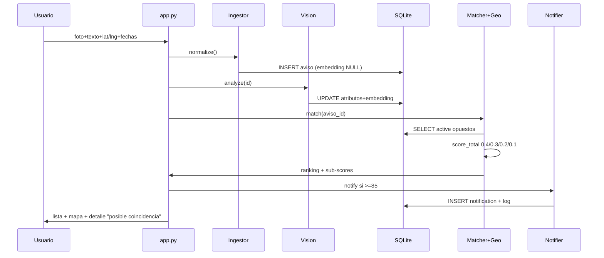

# MascotasLost&Found — architecture.md

> Fuente: `requirements.md` (§REQ-03 a §REQ-08, v1.0 23/09/2026).
> Stack **cerrado**: Streamlit + Python + SQLite, 100% local. CLIP 512-dim + MiniLM multilingüe. Radio 15 km. Umbrales `>=`.

## 1. Visión arquitectónica

Monolito Streamlit + módulos Python por agente + SQLite como única persistencia. Sin servicios externos obligatorios para que el profesor ejecute en local con un comando.

Elección justificada por restricciones: 2 semanas, evaluación local <10 min, corpus 15-20 avisos, sin scraping.

```
[ Usuario Streamlit ]
   | foto + texto + ubicación + fecha
   v
[1. Ingestor] --normaliza--> [SQLite: avisos]
   |
   v
[2. Vision Analyst] --atributos + image_embedding--> [SQLite update]
   |
   v (aviso activo)
[3. Matcher] <--consulta--> [SQLite active lost/found]
   |  ├─ pide similitud_visual (coseno embeddings)
   |  ├─ pide proximidad_geo a [4. Geo]
   |  ├─ calcula similitud_texto (estruct + semántica)
   |  └─ calcula proximidad_temporal (ventana 30d)
   v
[Ranking score_total + sub-scores]
   |
   ├─ >=80% --> [5. Notifier] --> panel Streamlit + log + tabla notifications
   ├─ 65-84.99% --> listado normal
   └─ <65% --> solo indexado
   |
   v
[Mapa + Detalle "posible coincidencia" + aviso no-identidad]
```

Aviso legal único en el sidebar (expander AVISO LEGAL): "Este análisis no promete una coincidencia inequívoca respecto al animal buscado. Una imagen no permite confirmar la identidad, verifique en persona."

## 2. Stack cerrado 23/09/2026 (100% local)

| Capa | Decisión | Notas |
|---|---|---|
| App / UI | Streamlit (`app.py`) + `streamlit-folium` (Leaflet clicable) | Español solo; Jerez de la Frontera como seed |
| Backend lógica | Python 3.11, módulos `agents/` puros | Sin LangChain/CrewAI |
| Base datos | SQLite (`data/huellas.db`) + sqlite3 | Cero setup |
| Vector store | Misma SQLite: `image_embedding` JSON 512-dim + `text_embedding` opcional | Coseno en numpy, sin FAISS/Chroma |
| Visión | CLIP `openai/clip-vit-base-patch32` 512-dim | `breed_guess` NULL si `other` |
| Visión fallback | Histograma color 8³ 512 (sin torch) → hash | Vectores seed precomputados en `data/seed/embeddings.json` (Cloud sin torch) |
| Texto | `sentence-transformers/paraphrase-multilingual-MiniLM-L12-v2` sobre `description_text` + 70% estructurado | Campos: `color_primary`, `markings`, `has_collar`, `size` |
| Geo | haversine local + `max(0, 1 - km/15)` | Radio fijo 15 km |
| Temporal | `max(0, 1 - dias/30)`, fecha = `date_last_seen` si existe si no `date_reported` | Ventana 30d |
| Notifier MVP | Panel/tabla Streamlit + `data/notifications.log` + tabla `notifications` | Sin Telegram |
| Seed | `data/seed/lost/*.json` + `found/*.json` + `images/*` + `scripts/load_seed.py` | 15-20 avisos Jerez |
| Estado | Botón "Marcar como resuelto" + `expire_old()` 365d bajo demanda | Sin cron |

## 3. Estructura de carpetas (propuesta)

```
huellas/
  app.py
  requirements.txt
  README.md / PROMPT-LOG.md / INFORME.md
  requirements.md / architecture.md (este repo: raíz, espejo en specs/ si se quiere)
  agents/
    ingestor.py      # REQ-06.1
    vision.py        # REQ-06.2
    matcher.py       # REQ-06.3 + REQ-07
    geo.py           # REQ-06.4
    notifier.py      # REQ-06.5 + REQ-08
  rag/
    embeddings.py    # texto semántico
    retrieval.py     # top-k + filtros active + tipo opuesto
  data/
    huellas.db
    seed/lost/*.json
    seed/found/*.json
    seed/images/*
    notifications.log
  scripts/
    load_seed.py
    eval_match.py    # test ÉXITO-01/03 con vectores fijos
  tests/
    test_matcher.py
    test_geo.py
```

## 4. Modelo de datos y relación con código

Tabla `avisos` espejo 1:1 del esquema REQ-05:

- `id TEXT PK, type TEXT CHECK(lost,found), animal TEXT, breed_guess TEXT NULL, color_primary TEXT, color_secondary TEXT NULL, markings JSON, size TEXT, has_collar INT, collar_description TEXT NULL, description_text TEXT, lat REAL, lng REAL, address_text TEXT NULL, date_reported TEXT, date_last_seen TEXT NULL, image_url TEXT, image_embedding JSON, contact_info TEXT NULL, status TEXT`
- Índices: `(status, type)`, `(animal)`.
- Tabla `notifications(id, aviso_id, candidato_id, score, created_at)` para auditoría de Notifier.
- `image_embedding` se almacena como JSON array; el cálculo coseno vive en `agents/matcher.py`, no en SQL.
- `rag/retrieval.py` filtra `status=active AND type != query.type` antes de puntuar (REQ-05.4).

## 5. Flujo entre agentes (detalle)

1. **Ingestor (`agents/ingestor.py`)**: valida tipos, genera UUID, normaliza strings (lower/trim), convierte ubicación a float, parsea ISO8601, guarda con `image_embedding=NULL`, `breed_guess=NULL`, `status=active`. Preserva `description_text` intacto. Valida `other`: exige `color_primary`, `size`, `description_text`. No llama a visión.
2. **Vision Analyst (`agents/vision.py`)**: input `id`; carga imagen local `data/seed/images/`; devuelve `{animal, breed_guess (NULL si other), color_primary/secondary, markings, size, has_collar, collar_description, image_embedding CLIP 512}`; hace UPDATE con precedencia sobre atributos visuales.
3. **Geo (`agents/geo.py`)**: `haversine_km(lat1,lng1,lat2,lng2)` + `proximidad = max(0, 1 - km/15)`. Constante `RADIO_MAX_KM=15`.
4. **Matcher (`agents/matcher.py`)**: para `aviso_q` contra candidatos opuestos activos: `visual 0.40 + texto (0.70*estruct+0.30*semant) 0.30 + temporal max(0,1-dias/30) 0.20 + geo 0.10`, ordena desc, aplica `>=85 / >=65`. Expone `explain(match)` con 4 sub-scores para UI.
5. **Notifier (`agents/notifier.py`)**: si `score>=85`, inserta en `notifications` + escribe log + marca panel. Sin Telegram.

Diagrama secuencia CU-01/CU-02:



## 6. Motor RAG textual (sub-componente de Matcher, cerrado)

- Ingesta: `description_text` intacto + estructurados (`color_primary`, `markings`, `has_collar`, `size`).
- `similitud_texto = 0.70 × estructurado + 0.30 × semántico`. Estructurado: media de 4 matches exactos (color 1/0, size 1/0, collar 1/0, markings Jaccard). Semántico: coseno MiniLM `paraphrase-multilingual-MiniLM-L12-v2`.
- Retrieval: filtro duro `status=active AND type != query.type` → puntuación → orden.
- Sin LLM generativo: retrieval + ranking explicable + plantilla determinista en español.

## 8. Capa UI Inicio / navegación lateral (REQ-UI-01..84, v1.32 25/09/2026)

Solo `app.py` + `ui_home.py` puro (testeable sin Streamlit). Sin cambios en
`agents/`, `rag/`, matcher ni esquema BD.

```
[ Sidebar: 5 principales rojos + secundarios negros tabulados ]      [REQ-UI-02]
  INICIO (home, barra blanca + fondo oscuro si page=="inicio")
  FUNCIONALIDADES (apps, único abierto; negros indentados: Publicar + Búsqueda)
  PUNTUALIZACIONES WEB (warning → Cómo puntúa + Aviso legal)
  (sin DATOS DEMO desde v1.29)
  MÁS (+ add → Protectoras + Tiempo, negros indentados con sus iconos)
  ADMINISTRACIÓN (key → login + moderación + reencuentros)
        | session_state.page (rerun, conserva filtros; reabre FUNCIONALIDADES)
        v
[ Inicio (page="inicio", defecto) ]                               [REQ-UI-01]
  Hero HTML (fade-up una vez, CASA roja subrayada, corazón SVG latido) [REQ-UI-05]
    (sin línea JEREZ DE LA FRONTERA: ya está en el header)
  + 2 st.button primary rojos idénticos (Publicar · Búsqueda) con pulse [REQ-UI-03/04]
  Carrusel HTML marquee (pista x2, 32s linear infinite, pausa hover)   [REQ-UI-06]
    select_carousel_items(avisos, 12) → sin contact_info por construcción
    make_carousel_thumb(path) letterbox crema 300×208, animal entero centrado
    carousel_thumb() = wrapper st.cache_data(ttl=120) → data-URI JPEG
    <a href="?aviso=id"> → destacar_id + page perdidos/encontrados
  3 st.button contadores blancos (navegación interna, misma pestaña) [REQ-UI-06]
    perdidos → perdidos · avistamientos → encontrados · reencuentros → reencuentro
    (`?page=` sigue soportado como deep-link de compatibilidad)
```
Query `?page=`/`?aviso=` se lee al inicio del run, navega y se limpia (`st.rerun`).

- Estilos: un único `inject_ui_css()` con clases `huellas-*` + reutilización de
  `inject_background()` (paleta `#E30613/#23201B/#FFFFFF/#F5F1EA/#57503F`,
  Inter+Montserrat, logo y fondo intactos). Principales sidebar rojos `#E30613`
  grandes (`padding .75rem 1rem`, `1.02rem`, negrita); secundarios negros `#23201B`
  con `margin-left 1.25rem`; `hover translateX(3px)`; activo con
  `border-left 3px #FFFFFF` + fondo `#23201B`. Pulso CTAs hero:
  `::after ring 2.2s infinite`. Sin bocadillos: cero `help=` y sin `title=` en el
  carrusel; campos obligatorios de buscar/publicar marcados con `*`.
- Títulos v1.12 (solo CSS): `.huellas-barrido` (barrido rojo izq↔der sobre negro,
  Publicar + Buscar) + `.huellas-perimetro` con huella roja SVG recorriendo el borde
  (`huellas-peri 6s`, MASCOTAS DESAPARECIDAS / RASTROS COMPARTIDOS / VOLVIÓ A CASA).
  Buscar = `ANÁLISIS PRELIMINAR…` + pasos 1–5; mapa de zona con AMBOS lados.
- Publicar con vida v1.13 (solo CSS + `session_state`, sin JS): cascada global
  (`huellas-cascade`, hijas del bloque principal, 60 ms); foto con borde discontinuo +
  huella flotante + escaneo 1,5 s + "Foto analizada"; Confirmar con pulso/shake
  (`confirm_pub_{n}` + `faltantes_publicar()` pura en `ui_home.py`); cruce con dots +
  progreso ≥1,5 s;   tarjeta match con anillo y dígitos de valores FIJOS por tarjeta
  (sin `@property`/counters) + "Ver aviso y contactar"; check dibujado si no hay match.
- v1.14: color+descripción obligatorios (`faltantes_publicar` + tests); foto sin huella
  ni caption con `min-height:190px`; autocompletado Nominatim con caché 1 h
  (`sugerir_direcciones()` + `short_addr()` puro, radio de sugerencias que centra el mapa).
- v1.15: sugerencias como lista emergente (botones `addr_sug_{i}` blancos con chincheta
  CSS, `!important` estático para ganar al secundario oscuro); "Foto analizada" en fila
  flex a la derecha de la imagen.
- v1.16: etiqueta más grande y centrada (`.huellas-scanbadge`), imagen a 300px con aire;
  revert total de sugerencias (fuera código, CSS y helpers; ubicación como antes).
- v1.17: boli escribiendo en el hueco de la columna derecha (solo con foto);
  admin con foto a 220px + `max-width:100%` en el sidebar.
- v1.18: Buscar con radar/shake/resultados (anillo+barras fijas, top destacado,
  "Guardar como aviso" con rebote); Perdidos/Avistamientos con contacto bajo demanda,
  chips de días/nuevo (`dias_perdido()`/`es_nuevo()` puros en `ui_home.py`).
- v1.19: foto lateral + flash en ambas; seed con fechas 25/08–25/09 (SEED v7) y formato
  DD/MM/AA; leyenda en Publicar; fix widget-dirección + cachés Nominatim; contacto con
  `<details>` (sin rerun).
- v1.20: insignia grande con flecha y destello dentro (`badge_lateral_html()`); doble
  clic documentado en ambos mapas.
- v1.21: `target="_self"` en enlaces + `?s=` con `sync_page_from_url()` (atrás);
  fechas editables en admin; insignia XL.
- v1.22: foto centrada sin insignia; `?s=` como deep-link (atrás documentado como
  límite); reencuentros en ES con shake/revisión/fiesta/tarjetas cerradas/vacío.
- v1.23: preview de elegidos, tarjeta con marca/pie en ambos estados, nota vacía,
  cerrados de 3 en 3.
- v1.24: lluvia/ruleta por estado, tarjeta translúcida, nota bajo especie·color.
- v1.25: admin fluido + gestor de reencuentros (`delete_reencuentro()`); seed 20
  avisos (SEED v8, siamés como `lost_007`); carrusel con etiqueta de reencuentro.
- v1.26: velo en contadores + pulso en CTAs; expiración 365d; `lost_006` activo
  (SEED v9); etiqueta en bloque; gestor arriba del admin.
- v1.27: velo sin `!important` (auditoría S76 completa); reencuentro con limpieza,
  par lado a lado, doble foto y 20 corazones.
- v1.28: revisión sin doble borde; solo preview de subidas; lluvia uniforme;
  contadores negros en negrita y altos.
- v1.29: fuera DATOS DEMO (demo siempre instaurada; sidebar de 5).
- v1.30: mapas con clave-fingerprint; contadores chicos; lluvia 36 uniforme;
  limpieza con rotación de clave (quirk file_uploader).
- v1.31: época en todos los campos de Publicar/Reencuentro (los borrados no bastan
  en navegador real).
- v1.32: puntualizaciones a todo ancho; protectoras/tiempo en desplegables del sidebar.
- Accesibilidad/móvil: todo CSS, sin JS ni libs; `prefers-reduced-motion: reduce`
  apaga `trk/up/pulse/subrayado/latido/sweep/peri`; inicio con botones reales (no links).
- Trazabilidad: `tests/test_carousel.py` (sin contacto, letterbox 300×208, counts con
  links) + `tests/test_seed.py` (todo seed con contacto) + `smoke_app.py` (9 páginas).

## 7. Decisiones aplicadas 23/09/2026 (huecos H-01 a H-10 cerrados)

- H-01 radio: 15 km fijos.
- H-02 texto: 70/30 + modelos fijados.
- H-03 temporal: `max(0,1-dias/30)`, `date_last_seen` si existe si no `date_reported`.
- H-04 precedencia: Vision manda en visual; texto intacto.
- H-05 embedding: CLIP `openai/clip-vit-base-patch32` 512-dim.
- H-06 Notifier: panel + log + tabla, sin Telegram.
- H-07 `image_url`: ruta local `data/seed/images/`.
- H-08 umbrales: `>=`.
- H-09 estado: botón manual + `expire_old()` bajo demanda.
- H-10 vector store: misma SQLite.
